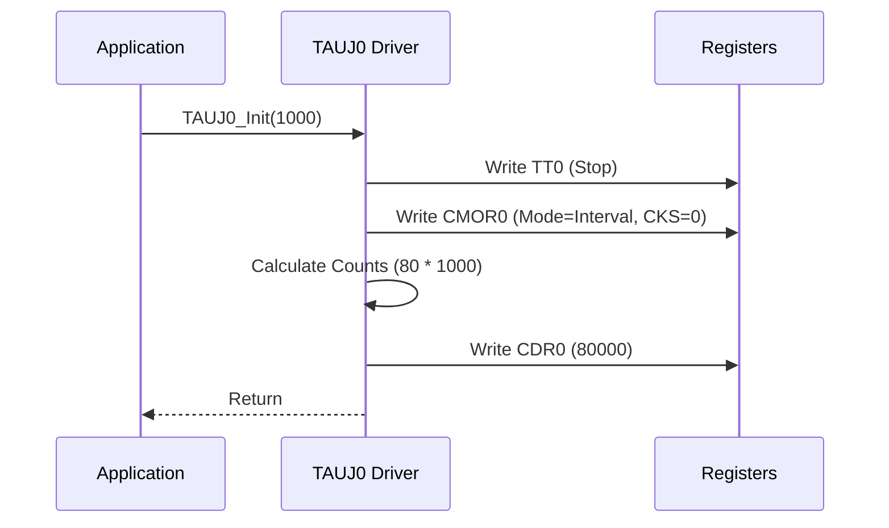
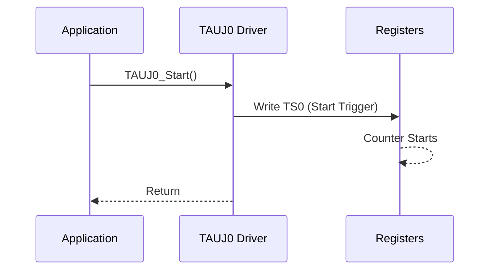

# TAUJ0ドライバ アーキテクチャ設計書

## 1. はじめに
本ドキュメントは、ルネサス エレクトロニクス製マイクロコントローラ RH850F1KMS-1 向けの TAUJ0 (Timer Array Unit J) ドライバのソフトウェアアーキテクチャおよび設計について記述します。

## 2. システム概要
TAUJ0ドライバは、インターバルタイマとして構成されたTAUJ0周辺機能に対するハードウェア抽象化レイヤを提供します。これにより、アプリケーション層はハードウェアレジスタを直接操作することなく、タイマの初期化、開始、停止、およびインターバル設定を行うことができます。

### 2.1 ハードウェアコンテキスト
- **マイクロコントローラ**: Renesas RH850F1KMS-1
- **周辺機能**: TAUJ0 (Timer Array Unit J, Unit 0)
- **チャネル**: Channel 0 (TAUJ00)
- **クロックソース**: PCLK (80MHzと仮定)

## 3. ソフトウェアアーキテクチャ

### 3.1 レイヤ構造
ソフトウェアは以下のレイヤで構成されています：

- **アプリケーション層**: `main.c` (ドライバを使用)
- **ドライバ層**: `tauj0.c`, `tauj0.h` (ロジックを実装)
- **ハードウェア抽象化レイヤ (レジスタ)**: `tauj0_regs.h` (メモリマップを定義)
- **ハードウェア**: RH850F1KMS-1 デバイス

### 3.2 ファイル構成
| ファイル | 説明 |
|----------|------|
| `tauj0.c` | ドライバ実装 (ソース) |
| `tauj0.h` | 公開API宣言 (ヘッダ) |
| `tauj0_regs.h` | レジスタ定義およびビットマスク |

## 4. コンポーネント設計

### 4.1 機能説明
ドライバは TAUJ0 チャネル0 を **インターバルタイマモード** で動作させます。
- **カウンタ**: ダウンカウント (または特定のモードに応じたアップカウント、ここでは標準的なインターバルロジック)。
- **インターバル**: マイクロ秒単位で設定可能。
- **割り込み**: カウンタ満了時に割り込み (INTTAUJ0I0) を生成。

### 4.2 API仕様

#### `void TAUJ0_Init(uint32_t interval_us)`
TAUJ0チャネルを初期化します。
- **パラメータ**: `interval_us` - タイマインターバル（マイクロ秒）。
- **操作**:
    1. タイマを停止 (TT0)。
    2. モード (CMOR0) をインターバルタイマに設定。
    3. 初期インターバルを設定 (CDR0)。

#### `void TAUJ0_Start(void)`
タイマカウンタを開始します。
- **操作**: TS0ビットを設定。

#### `void TAUJ0_Stop(void)`
タイマカウンタを停止します。
- **操作**: TT0ビットを設定。

#### `void TAUJ0_SetInterval(uint32_t interval_us)`
タイマインターバルを更新します。
- **パラメータ**: `interval_us` - 新しいインターバル（マイクロ秒）。
- **計算式**: `Counts = interval_us * (SystemClock / 1,000,000)`

### 4.3 レジスタ使用状況
| レジスタ | オフセット | 説明 | アクセス |
|----------|------------|------|----------|
| `CDR0`   | 0x0000 | チャネルデータレジスタ (インターバル値) | R/W |
| `CMOR0`  | 0x0080 | チャネルモードOSレジスタ (モード/クロック) | R/W |
| `CSR0`   | 0x0040 | チャネルステータスレジスタ (オーバーフロー/アンダーフロー) | R |
| `TE0`    | N/A    | タイマイネーブルステータス (TS0/TT0ロジック経由) | R |
| `TS0`    | 0x0014 | タイマスタートレジスタ | W |
| `TT0`    | 0x0018 | タイマストップレジスタ | W |

## 5. 動的振る舞い

### 5.1 初期化シーケンス

### 5.2 開始シーケンス

