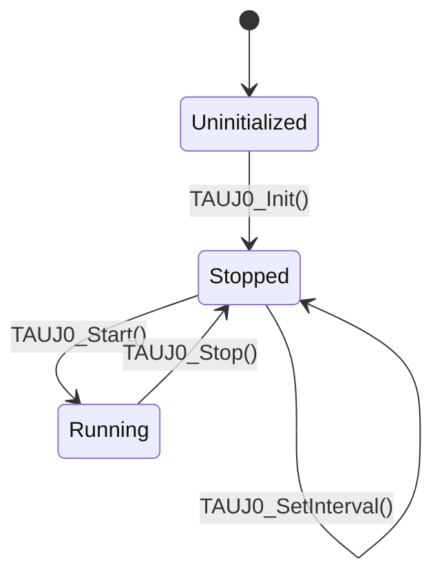

# TAUJ0ドライバ 基本設計書

## 1. システム構成

### 1.1 概要
本ドライバは、RH850F1KMS-1マイクロコントローラのTAUJ0 (Timer Array Unit J) を制御し、アプリケーションに対して周期的なインターバルタイマ機能を提供する。

### 1.2 ハードウェア構成
- **対象デバイス**: Renesas RH850F1KMS-1
- **使用リソース**:
    - TAUJ0 ユニット0
    - チャネル0 (TAUJ00)
    - クロックソース: PCLK (80MHz)
    - 割り込み: INTTAUJ0I0

### 1.3 ソフトウェア構成
- **開発言語**: C言語 (C99準拠)
- **コンパイラ**: Renesas CC-RH
- **コーディング規約**: MISRA C:2012

## 2. 機能仕様

### 2.1 機能一覧
| 機能ID | 機能名称 | 説明 |
|--------|----------|------|
| F01 | 初期化機能 | TAUJ0チャネルをインターバルタイマモードで初期化する。 |
| F02 | 開始機能 | タイマカウントを開始する。 |
| F03 | 停止機能 | タイマカウントを停止する。 |
| F04 | 周期設定機能 | タイマのインターバル周期をマイクロ秒単位で設定する。 |
| F05 | 割り込み通知 | カウント満了時に割り込みを発生させる。 |

### 2.2 状態遷移
ドライバは以下の状態を持つ。

- **Uninitialized**: 初期化前の状態。ハードウェアはリセット状態または不定。
- **Stopped**: 初期化済み、カウント停止状態。設定変更が可能。
- **Running**: カウント動作中。割り込みが発生する。

## 3. インターフェース仕様

### 3.1 API仕様

#### 3.1.1 TAUJ0_Init
- **概要**: TAUJ0チャネルの初期化を行う。
- **プロトタイプ**: `void TAUJ0_Init(uint32_t interval_us)`
- **引数**:
    - `interval_us`: 設定するインターバル周期 (マイクロ秒)
- **戻り値**: なし
- **前提条件**: なし
- **事後条件**: ドライバ状態が `Stopped` に遷移する。

#### 3.1.2 TAUJ0_Start
- **概要**: タイマカウントを開始する。
- **プロトタイプ**: `void TAUJ0_Start(void)`
- **引数**: なし
- **戻り値**: なし
- **前提条件**: `TAUJ0_Init` が実行済みであること。
- **事後条件**: ドライバ状態が `Running` に遷移する。

#### 3.1.3 TAUJ0_Stop
- **概要**: タイマカウントを停止する。
- **プロトタイプ**: `void TAUJ0_Stop(void)`
- **引数**: なし
- **戻り値**: なし
- **前提条件**: なし
- **事後条件**: ドライバ状態が `Stopped` に遷移する。

#### 3.1.4 TAUJ0_SetInterval
- **概要**: インターバル周期を変更する。
- **プロトタイプ**: `void TAUJ0_SetInterval(uint32_t interval_us)`
- **引数**:
    - `interval_us`: 新しいインターバル周期 (マイクロ秒)
- **戻り値**: なし
- **備考**: タイマ動作中に呼び出した場合、次回のカウントサイクルから反映される（または即時反映、実装依存）。本実装ではCDR0への書き込みのみ行うため、動作中の変更も可能だが、推奨は停止中の変更とする。

## 4. データ仕様

### 4.1 レジスタマップ
| レジスタ名 | アドレス | ビット幅 | 説明 |
|------------|----------|----------|------|
| CDR0 | Base + 0x0000 | 32 | データレジスタ (周期設定値) |
| CMOR0 | Base + 0x0080 | 16 | モードレジスタ (動作モード、クロック選択) |
| TS0 | Base + 0x0014 | 8/16 | スタートトリガ |
| TT0 | Base + 0x0018 | 8/16 | ストップトリガ |
| TO0 | Base + 0x0010 | 8/16 | 出力状態 |
| TOE0 | Base + 0x001C | 8/16 | 出力許可 |

## 5. 制限事項・注意事項
- **最大周期**: 32ビットカウンタと80MHzクロックにより、最大約53秒 (`0xFFFFFFFF / 80MHz`) までの周期設定が可能。
- **最小周期**: オーバーヘッドを考慮し、数マイクロ秒以上を推奨。
- **割り込み**: 割り込みハンドラの実装およびベクタテーブルへの登録は、本ドライバの範囲外（アプリケーション側で実施）とする。
